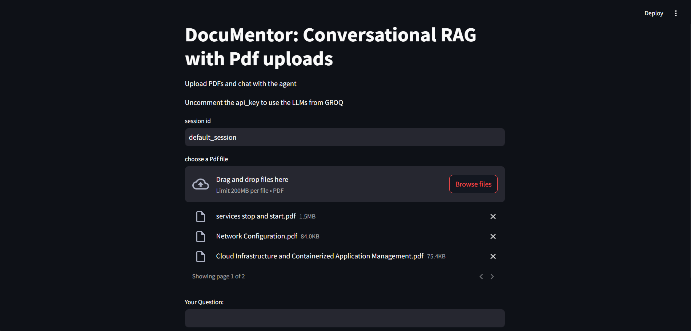

# RAG DocuMentor

## Goal

The primary goal of this project is to provide an interactive platform where users can upload documents and ask questions based on the content of those documents. By leveraging a local copy of the **Ollama model**, **Hugging Face embeddings**, and **FAISS for vector storage**, the system answers questions from the uploaded documents using a Retrieval-Augmented Generation (RAG) architecture.

## Description

RAG DocuMentor allows users to interact with uploaded documents via a simple web-based UI built with **Streamlit**. After documents are uploaded, the system uses the **Ollama model** (a pre-trained language model) and **Hugging Face embeddings** to provide relevant answers to user queries based on the contents of the documents.

The process involves:
1. **Document Upload**: Users upload documents (e.g., PDFs, text files) through a user-friendly Streamlit interface.
2. **Text Embedding**: The contents of these documents are converted into embeddings using **Hugging Face’s embedding models**.
3. **Document Storage**: The document embeddings are stored using **FAISS** for efficient similarity search.
4. **Question Answering**: When a user asks a question, the system uses the **Ollama model** to generate answers based on the closest matching document segments.

This system enables easy access to specific information hidden within large volumes of text, facilitating document exploration and retrieval in a smart, efficient way.

## Screenshots

### Screenshot 1: Document Upload Interface
  
*Streamlit UI for uploading documents.*

### Screenshot 2: Question Input and Answer Output
  
*Interface where users can ask questions and get answers based on document content.*

### Screenshot 3: Document Retrieval and Answer Display
  
*View of document retrieval and display of the generated answer.*

## Tools Used

- **Ollama Model**: A local pre-trained language model for question generation, integrated with the `langchain_community` library.
- **Hugging Face Embeddings**: Used for converting documents into dense vector embeddings that represent their semantic content.
- **FAISS**: For efficient similarity search and nearest-neighbor retrieval in large-scale datasets. Integrated through the `langchain_community.vectorstores`.
- **Streamlit**: A Python framework used to build the user interface where users upload documents and interact with the model.
- **Langchain Components**:
  - `PyPDFLoader`: For loading and parsing PDF files into text.
  - `BaseChatMessageHistory`: For managing chat history in the conversation-based interface.

## Methodology

1. **Document Upload**: Users upload documents through the Streamlit UI. The document can be in formats like PDF or plain text.
2. **Document Parsing**: The document is parsed using **PyPDFLoader** if it's a PDF file and converted to text.
3. **Embedding Generation**: The text content of the documents is embedded using **Hugging Face’s embedding models**.
4. **Document Storage**: The embeddings are stored in a **FAISS** index for efficient similarity search and retrieval.
5. **Query Input**: The user asks a question through the UI, which is then transformed into an embedding using the same model.
6. **Retrieval**: The closest document segments, based on the similarity between the query embedding and document embeddings, are identified using **FAISS**.
7. **Answer Generation**: The relevant context is passed to the **Ollama model**, which generates an answer based on the provided context.
8. **Display**: The generated answer is displayed back to the user via the Streamlit interface.

## Acknowledgements

- **Ollama**: For providing a powerful local language model for question answering.
- **Hugging Face**: For their embeddings and transformer models that power document understanding and question answering.
- **FAISS**: For efficient similarity search and nearest-neighbor retrieval.
- **Streamlit**: For enabling the creation of an interactive web UI.
- **Langchain**: For the community-driven components that make it easy to integrate various tools for document processing and retrieval.

---
